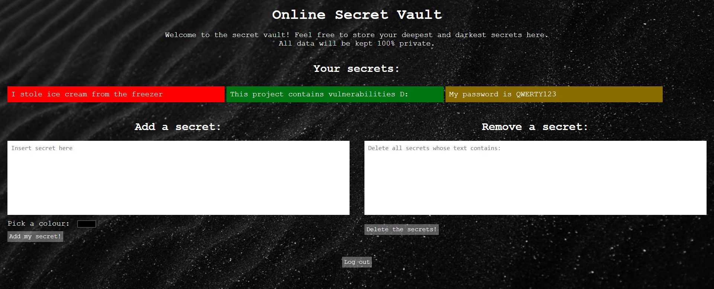

# Cyber Security Base 2020: Project 1

The first course project for the Cyber Security Base 2020 course at the Open University of Helsinki.

The project features a basic "vault" app, where users can log in and store their own secrets along with a colour.
Users can also delete all secrets containing a certain substring.
The app is designed to simulate a broken web application with the secrets being sensitive data.

As outlined in the [course page](https://cybersecuritybase.mooc.fi/module-3.1), this project contains
a number of cybersecurity vulnerabilities from the [OWASP Top 10 list](https://owasp.org/www-project-top-ten/).
This document contains information on the implemented vulnerabilities and how to fix them.

---

## Installation instructions

1. Install the required dependencies as outlined in the
[course installation guide](https://cybersecuritybase.mooc.fi/installation-guide)
1. Clone the repository
1. Run the `first_setup.sh` or `first_setup.bat` script on Unix and Windows, repsectively
1. The server should now be started
1. Access the website by typing `localhost:8000` in your browser
1. Log in with the default accounts:

   | Username | Password |
   |:--------:|:--------:|
   | alice    | redqueen |
   | bob   | squarepants |

1. After you are done, close the server with CTRL+C in the terminal
1. If you need to open the server again, simply execute the `run.sh` or `run.bat` script on
Unix and Windows, repsectively.

---

## Flaws

### Flaw 1: Injection

Injection vulnerabilities are the most common vulnerability on the OWASP Top 10 list.
Injection can happen when untrusted (attacker-controlled) data is sent to an interpreter.
While this can happen in many languages, it is most often found in database query languages
such as SQL.

In this project, I have implemented an SQL injection vulnerability into the vault application.
While there is no issue with adding secrets, as it uses Django's own model system, deleting a note
opens up an SQL injection attack. This is because the deletion uses the custom SQL request
`"SELECT * FROM vulns_note WHERE owner_id = {} AND text LIKE '%{}%'".format(request.user.id, text)`.
Since the raw text is subsituted into this query, an attacker can terminate it using a `'` and write
their own query afterwards. For example, submitting `' OR '%'='` into the `Remove a secret` box
will remove _all_ secrets from _all_ users, which would be a huge security oversight in a real application.

Fixing this is easy: Django provides the model system which includes protections against injection
attacks. It does so by escaping "dangerous" character sequences and including other checks on untrusted
data. An example of how the system is used can be seen in the `addnote()` function of `views.py`.

### Flaw 2: Broken Authentication

Broken Authentication can happen in a number of ways. Passwords can be sent insecurely, a login system
can be implemented incorrectly, or there can be a flaw in the session key system.

This project has a flaw in the latter: the session IDs generated are very predictable. They take on
the form `logincookie-N` where `N` is an integer from 0 upwards. Each new user gets the next integer
as their login cookie. This can be exploited using a simple session hijacking script, which sequentially
tests all session IDs and finds one corresponding to the logged in user.

In fact, this issue is only exploitable because the project uses a custom session manager (`securesessions.py`).
Django provides its own, secure, session manager in the form of the middleware
`django.contrib.sessions.middleware.SessionMiddleware`. It generates secure, unpredictable session keys, for
which bruteforcing would take an infeasible amount of time. It is enabled by default. Therefore, if a project
does not need a custom session manager (and there is generally no reason one would), it should not attempt to
modify the existing one.

### Flaw 3: Sensitive Data Exposure

Sensitive Data Exposure happens when data a user thinks is secure is stored or transferred in a way that can
be accessed by attackers. This can happen at rest, where data is not properly encrypted in a database, or in
transit, where data is sent in plain text or in an insecure manner.

The problem is visible in this project when secrets are added. The sensitive data that the user thinks is
added securely is actually sent using a GET method to the server. This means that the secret, colour, and
username are all visible in the URL `/addnote?user=...&note=...&colour=...`. If an attacker sees what URLs their
victim is accessing, has access to their browser history, or otherwise sees what requests come to the server,
they can easily figure out what secrets are being stored.

The first thing that must be done to remedy this is to use a POST request for adding secrets. Not only will
this keep the secrets hidden, it will also prevent users from accidentally re-adding secrets by refreshing the
page. In addition, it would be smart to encrypt the secrets (and colours) with the user's personal key and stored
as such in the database so that, even in the case of a data leak, the information would be useless. 

### Flaw 4: Broken Access Control

In a Broken Access Control vulnerability, the things that authenticated or other users can access are not
properly limited. Attackers can exploit this to access, add, remove, or do other things to unauthorised data.

The issue is again visible in the GET request that is used to add secrets. While the `addnote()` function
requires authentication to be executed, it does not verify that the _correct_ user is logged in, but rather
reads the username from the GET parameters. For example, Bob can add a secret to Alice's account by logging in
and accessing `/addnote?user=alice&note=HACKED&colour=%23ff0000`.

To fix this, we can simply remove the user field from the GET request, and make the `addnote()` function get
the user object with `request.user`. Similarly to the previous exploit, it would also help to make the request
go through POST and not GET.

### Flaw 5: Cross-Site Scripting (XSS)

XSS happens when unfiltered data is used to generate a webpage. Traditionally, the page contains HTML and
JavaScript. In an XSS attack, the unsafe data being rendered will execute arbitrary code in a victim's browser.

In this project, XSS can be used when adding a secret. Adding secrets is fine in and of itself; however,
the secrets are displayed in an insecure way. To get colours to work, the function that generates `index.html`
uses the line `'<li style="background-color: {}">{}</li>'.format(note.colour, note.text)`.
Normally, this generates a tag with a colour and text. However, if the colour or text is controlled by an
attacker, arbitrary HTML can be generated. For example, adding the secret ``
using the `Add a secret` box will run the JavaScript code when the secret is displayed. In conjunction with
Broken Access Control, XSS can be used to steal cookies and sensitive data from a user.

This can be fixed by properly escaping both the colour and text provided. Django's utilities provide a helper
function `django.utils.html.escape(text)`, which will prevent the XSS attack when rendering secrets.

---

## Credits

This project was developed by myself, with thanks to:

- Nikolaj Tatti, teacher, for clarification and help
- [@tamithia](https://github.com/tamithia) for adding CSS and graphics to the app
(authorised by Nikolaj Tatti)
